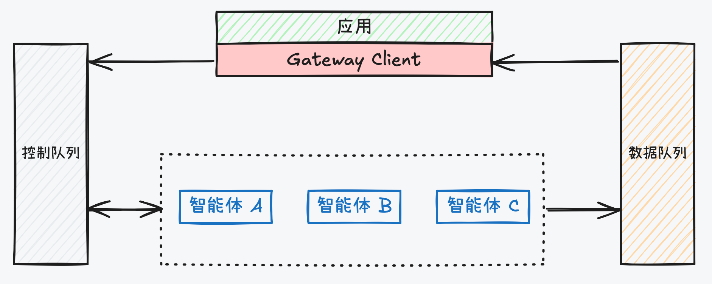

# by-framework

<div align="center">

[](https://pypi.org/project/by-framework/)
[](https://www.python.org/)
[](https://redis.io/)
[](LICENSE)

</div>

<div align="center">

[**English**](README.md) | [**中文**](README_zh.md)

**重要链接：** [文档](https://beyonai.github.io/by-framework-docs) · [Java 版本](https://beyonai.github.io/by-framework-java) · [TypeScript 版本](https://beyonai.github.io/by-framework-ts)

</div>

**by-framework** 是一个基于 Redis Streams 构建的分布式高性能 Agent 调度引擎，专为多 Agent 系统设计。

## 传统架构的困境

传统 AI 应用架构在面对 Agent 场景时常面临三大挑战：

- **全链路同步阻塞 $\rightarrow$ 迫使用户“人肉盯看”** — 前端与后端强绑定，页面关闭即任务中断。用户无法跨端切换，工作流极易因网络波动或意外打断而前功尽弃。
- **无法支撑超长任务 $\rightarrow$ 导致系统“全程陪同”** — 面对数分钟甚至小时级的推理，调用方必须持续阻塞线程等待，不仅面临网关超时截断，更造成了严重的计算资源空转与浪费。
- **多 Agent 编排的中断恢复困局** — 在复杂级联调用中，一旦出现超时或中断，系统难以精准定位状态并恢复，容易超时或结果错乱。

## By-Framework 的方案



By-Framework 通过**控制与数据平面分离**的异步架构解决上述问题：

- **指令异步化**：APP 通过 **Gateway Client** 将用户请求转化为控制指令并投入 **Control Queue**（控制队列）。由于是异步解耦，APP 无需阻塞等待，后端线程立即释放。
- **Agent 集群消费**：分布式的 **Agents** 集群竞争消费控制队列中的消息。通过逻辑寻址（Agent Type）自动实现负载均衡，天然支持动态扩缩容。
- **过程数据回传**：Agent 在执行过程中，将流式文本（Chunk）、状态变更（State）及产物（Artifact）异步推送到 **Data Queue**（数据队列），APP 通过 **Gateway Client** 实时监听该队列以获取任务进度，从而原生支持超长任务。
- **原生编排与中断恢复**：当 Agent 需要调用其他 Agent（编排）时，它会将新指令发往 **Control Queue**。这种基于消息的机制允许 Agent 任务在等待期间完全释放资源，并在收到回复指令后精准恢复上下文。

## 亮点

- 🔌 **插件系统** — 支持热加载的插件机制，提供生命周期钩子、工具、提示词和子 Agent 配置
- 🤝 **多 Agent 编排** — 内置 call_agent、scatter-gather 扇出和人机交互模式
- 🧩 **扩展生态** — 开箱即用的 Langfuse、Phoenix、PostgreSQL、LangGraph 及 Google ADK 集成包
- 🛡️ **生产就绪** — 竞争消费、优雅退出、消息持久化与配置快照


## 目录

- [架构](#架构)
  - [数据流](#数据流)
  - [组件层次](#组件层次)
  - [Worker 路由](#worker-路由)
  - [Redis 键位图](#redis-键位图)
- [快速开始](#快速开始)
  - [安装](#安装)
  - [快速上手](#快速上手)
- [核心概念](#核心概念)
  - [GatewayWorker](#gatewayworker)
  - [AgentContext](#agentcontext)
  - [协议与消息](#协议与消息)
  - [插件系统](#插件系统)
- [进阶功能](#进阶功能)
  - [Agent 间调用](#agent-间调用)
  - [Scatter-Gather 分发](#scatter-gather-分发)
  - [人机交互流程](#人机交互流程)
  - [服务发现](#服务发现)
- [发送任务](#发送任务)
- [扩展库](#扩展库)
- [配置参考](#配置参考)
- [开发](#开发)
- [部署](#部署)
- [路线图](#路线图)
- [贡献](#贡献)
- [许可证](#许可证)

---

## 架构

系统采用全异步、事件驱动的设计。控制消息和数据事件分别在独立的 Redis Stream 上传输，因此扩展 Worker 不会耦合到数据投递路径。

### 数据流

```
Client ──▶ Redis 控制流 ──▶ GatewayWorker (竞争消费)
           (queue:ctrl:{agent_type})
                                      │
                                      ▼
Consumer ◀──── Redis 数据流 ◀──── 业务逻辑 (输出 chunk/state/artifact)
Backend     (queue:data:{session})
```

1. **客户端**将命令写入指定 agent type 的控制流。
2. 订阅该 agent type 的任意在线 **GatewayWorker** 通过 Redis consumer group 竞争拉取消息。
3. Worker 处理任务后，通过 `AgentContext` 将流式文本、状态变更和产物等事件写回**会话级数据流**。
4. **后端**或**前端**消费者实时读取该数据流。

### 组件层次

| 层级 | 组件 | 源码 | 职责 |
|---|---|---|---|
| **客户端** | `GatewayClient` / `ByaiGatewayClient` | `client/` | 向 Redis 发布控制命令，支持拦截器和级联取消。 |
| **调度层** | Redis Streams + consumer groups | (基础设施) | 竞争消费，Worker 副本间自动负载均衡。 |
| **执行层** | `GatewayWorker` / `ByaiWorker` | `worker/` | 拉取任务，在隔离工作空间中执行业务逻辑，接入插件生命周期。 |
| **编排器** | `WorkerRunner` | `worker/runner.py` | 管理消息消费循环、并发信号量、优雅退出。 |
| **输出层** | `GatewayDataEmitter` | `common/emitter.py` | 将事件以 TTL 写入会话级数据流。 |
| **注册中心** | `WorkerRegistry` | `core/registry.py` | 基于 Redis 的 Worker 成员关系、心跳、执行状态追踪。 |
| **插件** | `PluginRegistry` | `core/extensions/` | 插件发现、生命周期钩子、Agent 配置版本管理、热加载。 |

### Worker 路由

三层语义决定任务如何到达 Worker：

| 层级 | 用途 | 更新时机 |
|---|---|---|
| **Membership** | Worker 通过 `get_agent_types()` 声明支持的 agent 类型。 | 启动 / 优雅退出 |
| **Online / Heartbeat** | 带 TTL 的 Redis key，Worker 定期刷新。只有在线 Worker 才算合法路由目标。 | 心跳周期 |
| **Worker ID Lock** | 防止同一 `worker_id` 重复启动。实例互斥，不参与路由。 | 启动 / 退出 |

**生产路径（agent type 路由）：**
- 客户端写入 `byai_gateway:ctrl:agent_type:{agent_type}`。
- 同一 consumer group 下的多个 Worker 竞争消费。
- 发送方只校验目标 agent type 是否至少有一个在线 Worker。

**调试路径（直连 Worker 路由）：**
- 显式传入 `target_worker_id` 时，消息写入 `byai_gateway:ctrl:worker:{worker_id}`。
- 发送方会显式校验该 Worker 是否在线。

### Redis 键位图

| 键模式 | 类型 | 用途 |
|---|---|---|
| `byai_gateway:ctrl:agent_type:{agent_type}` | Stream | 按 agent type 的控制队列；竞争消费 |
| `byai_gateway:ctrl:worker:{worker_id}` | Stream | 按 Worker 的控制队列；直连路由 |
| `byai_gateway:session:{session_id}:data_stream` | Stream | 会话级输出事件 |
| `byai_gateway:session:{session_id}:registry` | Hash | 会话执行记录 |
| `byai_gateway:task_group:{group_id}` | Hash | Scatter-gather 组进度追踪 |
| `byai_gateway:task_group:{group_id}:results` | Hash | Scatter-gather 结果收集 |
| `byai_gateway:registry:worker:online:{worker_id}` | String (TTL) | 心跳租约 |
| `byai_gateway:registry:agent_type:workers:{agent_type}` | Set | Agent type → Worker ID 映射 |
| `byai_gateway:registry:worker:agent_types:{worker_id}` | Set | Worker → agent type 映射 |
| `byai_gateway:agent_configs_snapshot:{key}` | String | 序列化的 Agent 配置快照（持久化恢复） |
| `byai_gateway:plugin_reload:{id}:ack` | Stream | 热加载 ACK 通道 |

---

## 快速开始

### 安装

**前置条件：** Python 3.12+, Redis 7.0+

```bash
# 使用 pip
pip install by-framework
```

可选扩展包：

```bash
pip install by-framework-trace-langfuse       # Langfuse 可观测
pip install by-framework-history-postgres     # PostgreSQL 历史存储
pip install by-framework-langgraph            # LangGraph 集成
```

### 快速上手

**1. 定义 Worker：**

```python
# my_agent.py
from by_framework import GatewayWorker, AgentContext, run_worker

class MyAgent(GatewayWorker):
    def get_agent_types(self):
        return ["my_agent"]

    async def process_command(self, command, context: AgentContext):
        await context.emit_chunk("你好，来自你的 Agent！")
        return {"status": "completed", "content": "你好，来自你的 Agent！"}

if __name__ == "__main__":
    run_worker(MyAgent, worker_id="worker-01")
```

**2. 启动 Redis：**

```bash
docker run -d -p 6379:6379 redis:7-alpine
```

**3. 启动 Worker：**

```bash
uv run python my_agent.py
```

**4. 发送任务：**

```python
# send_task.py
import asyncio
from by_framework import ByaiGatewayClient, WorkerRegistry, init_redis, close_redis

async def main():
    redis = init_redis(host="localhost", port=6379)
    registry = WorkerRegistry(redis_client=redis)
    client = ByaiGatewayClient(redis_client=redis, registry=registry)

    resp = await client.send_message(
        target_agent_type="my_agent",
        session_id="demo-session",
        content="你好！",
    )
    print(f"已发送: {resp.message_id}")

    await close_redis()

asyncio.run(main())
```

---

## 核心概念

### GatewayWorker

所有自定义 Worker 的抽象基类。你需要实现两个方法：

| 方法 | 是否必须 | 用途 |
|---|---|---|
| `get_agent_types()` | 是 | 返回该 Worker 能处理的 agent 类型列表，决定路由与注册。 |
| `process_command(command, context)` | 是 | 核心业务逻辑。接收命令对象和 `AgentContext`，返回 `AgentTaskResult` 或 dict。 |

基类自动处理：
- 消息生命周期（解析、解码、确认 ACK、持久化）
- 按会话/任务分配工作空间
- 插件钩子执行（on_task_start、on_task_complete 等）
- 子 Agent 调用编排（挂起、恢复、级联取消）
- 历史消息持久化（内存或可插拔后端）

### AgentContext

每个任务的运行时上下文，作为 `process_command()` 的第二个参数。

```python
async def process_command(self, command, context: AgentContext):
    # 流式输出
    await context.emit_chunk("第 1 步完成\n")

    # 状态更新
    await context.emit_state("分析中")

    # 产物 / 结构化数据
    await context.emit_artifact(ArtifactEvent(url="https://example.com/output.json"))

    # 调用另一个 Agent（可选挂起等待）
    reply = await context.call_agent(
        target_agent_type="translator",
        content="Hello world",
        wait_for_reply=True,
    )

    # Scatter-gather 扇出
    group = await context.dispatch_group([
        {"target_agent_type": "researcher", "content": "查找参考资料"},
        {"target_agent_type": "writer", "content": "起草摘要"},
    ])
    results = await context.collect_group_results(group["task_group_id"])

    # 向终端用户提问（挂起任务）
    return await context.ask_user(AskUserEvent(prompt="确认部署？"))
```

关键属性：`session_id`、`trace_id`、`message_id`、`parent_message_id`、`current_agent_id`。

### 协议与消息

命令与事件定义在 `core/protocol/` 中。系统支持以下命令类型：

| 命令 | 用途 |
|---|---|
| `AskAgentCommand` | 标准任务请求，携带 content、header 和可选的 `extra_payload`。 |
| `ResumeCommand` | 恢复挂起的任务（如 `ask_user` 后的回复），携带 `reply_data`。 |
| `CancelTaskCommand` | 优雅或强制取消，支持通过任务树进行 BFS 级联。 |
| `ReloadPluginsCommand` | 热加载所有 Worker 的插件，无需重启。 |

向数据流输出的事件类型：

| 事件 | 用途 |
|---|---|
| `StreamChunkEvent` | 增量流式文本 / 推理日志。 |
| `StateChangeEvent` | Agent 状态转换（思考中、完成、失败等）。 |
| `ArtifactEvent` | 结构化输出文件、URL 或附件。 |
| `AskUserEvent` | 请求人工输入的提示（触发任务挂起）。 |

消息上下文由 `MessageHeader` 承载（`message_id`、`session_id`、`trace_id`、`source_agent_type`、`target_agent_type`、`parent_message_id`、`task_group_id`、`user_code`）。

### 插件系统

插件是主要的可扩展性机制。它们注册声明工具、提示词、技能、回调和子 Agent 的 **AgentConfig**，并接入 Worker 生命周期。

#### 编写插件

```python
from by_framework import Plugin, PluginManifest, AgentConfig, PluginBuildContext, AgentContext

class WeatherPlugin(Plugin):
    def __init__(self):
        super().__init__(PluginManifest(plugin_id="weather", version="1.0.0"))

    async def register_agent_configs(self, ctx: PluginBuildContext) -> list[AgentConfig]:
        return [
            AgentConfig(
                agent_id="weather_agent",
                tools={
                    "get_weather": self._get_weather,
                },
                prompts={
                    "system": "你是一个天气助手。"
                },
            )
        ]

    async def _get_weather(self, city: str) -> dict:
        return {"city": city, "temp": 22, "condition": "晴"}

    # 生命周期钩子
    async def on_task_start(self, context: AgentContext): ...
    async def on_task_complete(self, context: AgentContext, result): ...
    async def on_task_error(self, context: AgentContext, error: Exception): ...
    async def on_task_cancel(self, context: AgentContext, reason: str): ...
    async def on_call_agent_start(self, context: AgentContext, target: str, content): ...
    async def on_call_agent_complete(self, context: AgentContext, target: str, result): ...
    async def on_worker_startup(self): ...
    async def on_worker_shutdown(self): ...
```

#### 加载插件

三种方式向 `run_worker()` 提供插件：

```python
# 1. 显式列表
run_worker(MyAgent, plugin_list=[WeatherPlugin()])

# 2. 配置回调
def setup(registry):
    registry.register_bundle(WeatherPlugin())
run_worker(MyAgent, plugin_configurator=setup)

# 3. 目录扫描（启动时）
run_worker(MyAgent, plugin_dir="./my_plugins")
```

#### 插件热加载

发送 `ReloadPluginsCommand` 即可在不重启 Worker 进程的情况下触发所有插件的 `reload()`。配置快照会以版本号形式持久化到 Redis，即使重启也能恢复到上一次的已知正确配置。

---

## 进阶功能

### Agent 间调用

Worker 可通过 `context.call_agent()` 委托另一个 Agent 执行。当 `wait_for_reply=True` 时，当前任务**挂起**，被调方运行至完成，回复以 `AgentTaskResult` 形式回到调用方。

框架自动处理：
- 任务树构建（父子链接用于级联取消）
- 被调方完成后的回调通知
- 回复消息的自动重新投递

### Scatter-Gather 分发

并行扇出多个子任务并收集结果：

```python
group = await context.dispatch_group([
    {"target_agent_type": "researcher", "content": "查找论文"},
    {"target_agent_type": "analyst",    "content": "总结发现"},
], wait_for_reply=True)

results = await context.collect_group_results(group["task_group_id"])
for r in results.values():
    print(r["content"])
```

组进度在 Redis 中追踪；`dispatch_group` 立即返回 `task_group_id`，可通过 `collect_group_results` 轮询结果。

### 人机交互流程

挂起任务并等待人工输入：

```python
from by_framework import AskUserEvent, ResumeCommand

async def process_command(self, command, context: AgentContext):
    if isinstance(command, ResumeCommand):
        # 这是用户的回复
        await context.emit_chunk(f"你说: {command.content}")
        return {"status": "completed"}

    # 挂起并提问
    return await context.ask_user(
        AskUserEvent(prompt="目标部署环境是什么？")
    )
```

### 服务发现

基于 Redis 的服务发现工具：

| 组件 | 职责 |
|---|---|
| `ServiceRegistry` | 服务注册 / 注销 / 心跳。 |
| `DiscoveryClient` | 带缓存的服务发现与轮询负载均衡。 |
| `DiscoveryHttpClient` | 在发现的服务节点间自动重试的 HTTP 客户端。 |

---

## 发送任务

### GatewayClient

```python
from by_framework import GatewayClient, WorkerRegistry, init_redis

redis = init_redis(host="localhost", port=6379)
client = GatewayClient(redis_client=redis, registry=WorkerRegistry(redis_client=redis))

# 发送到指定 agent type
resp = await client.send_message(
    target_agent_type="my_agent",
    session_id="sess-001",
    content="你的任务内容",
    user_code="user-123",
    metadata={"priority": "high"},
)

# 取消任务（包括子任务级联）
await client.cancel_task(
    message_id=resp.message_id,
    session_id="sess-001",
    reason="用户请求",
)
```

### ByaiGatewayClient

`GatewayClient` 的类型化封装，通过 Byai codec 自动序列化消息内容：

```python
from by_framework import ByaiGatewayClient, BaiYingMessage

client = ByaiGatewayClient(redis_client=redis, registry=registry)

# 自动编码 BaiYingMessage 内容
resp = await client.send_message(
    target_agent_type="chat_agent",
    session_id="sess-001",
    content=BaiYingMessage(role="user", content="你好"),
)
```

### 拦截器

在客户端注册请求拦截器进行自定义预处理：

```python
class AuthInterceptor:
    async def before_send(self, command, header):
        header.metadata["auth_token"] = "..."
        return command, header

client = GatewayClient(...)
client.add_interceptor(AuthInterceptor())
```

---

## 扩展库

与核心框架同仓库发布的可选 workspace 成员包：

| 包 | 用途 | 关键依赖 |
|---|---|---|
| `by-framework-trace-langfuse` | Langfuse LLM 可观测插件。设置了环境变量后 Worker 启动时自动发现。 | `langfuse` |
| `by-framework-trace-phoenix` | Arize Phoenix 追踪集成。 | `phoenix` |
| `by-framework-history-postgres` | 通过 `asyncpg` 将消息历史持久化到 PostgreSQL。 | `asyncpg` |
| `by-framework-history-byclaw` | Byclaw 专用历史后端。 | — |
| `by-framework-langgraph` | LangGraph 状态图适配器、Worker 和工具桥接。 | `langgraph`、`langchain-core` |

追踪服务商在 Worker 启动时通过 `TraceProviderFactory` 自动发现（前提是已安装对应包并配置了环境变量）。

---

## 配置参考

### `run_worker()` 参数

| 参数 | 类型 | 默认值 | 描述 |
|---|---|---|---|
| `worker_class` | `Type[GatewayWorker]` | *(必填)* | 你的 Worker 实现类。 |
| `worker_id` | `str` | `"worker-1"` | Worker 实例唯一标识。 |
| `redis_host` | `str` | `"localhost"` | Redis 地址。 |
| `redis_port` | `int` | `6379` | Redis 端口。 |
| `redis_db` | `int` | `0` | Redis 数据库编号。 |
| `redis_password` | `str \| None` | `None` | Redis 密码。 |
| `redis_username` | `str \| None` | `None` | Redis 用户名。 |
| `redis_max_connections` | `int` | `max_concurrency + 10` | Redis 连接池大小。 |
| `workspace_dir` | `str` | `"/tmp/gateway-workspace"` | 用于任务隔离的本地工作空间根目录。 |
| `consumer_group` | `str` | `"agent_engines"` | Redis Streams consumer group 名称。 |
| `max_concurrency` | `int` | `50` | 每个 Worker 的最大并发任务数。 |
| `fetch_count` | `int` | `10` | Redis `XREADGROUP` 批量拉取数量。 |
| `plugin_list` | `list[Plugin] \| None` | `None` | 显式传入的插件实例列表。 |
| `plugin_configurator` | `Callable \| None` | `None` | 编程式插件注册回调。 |
| `plugin_dir` | `str \| None` | `None` | 启动时扫描 `.py` 插件模块的目录。 |
| `plugin_hook_timeout_seconds` | `float \| None` | `None` | 单个插件钩子的超时时间。 |
| `plugin_log_hook_stats_on_shutdown` | `bool` | `True` | 退出时输出每个钩子的成功/失败统计。 |

### 环境变量

| 变量 | 默认值 | 描述 |
|---|---|---|
| `BYAI_WORKER_CONCURRENCY` | `50` | 覆盖 `max_concurrency`。 |
| `BYAI_WORKER_FETCH_COUNT` | `10` | 覆盖 `fetch_count`。 |
| `BYAI_REDIS_MAX_CONNECTIONS` | `max_concurrency + 10` | 覆盖 `redis_max_connections`。 |

---

## 开发

```bash
# 安装所有 workspace 依赖
make install

# 格式化（isort + ruff + pyink）
make format

# 代码检查（pylint + ruff）
make lint

# 运行全部测试
make test

# 运行单个测试文件
uv run pytest tests/worker/test_gateway_worker.py

# 按模式运行测试
uv run pytest -k "test_name_pattern"

# 完整 CI 检查
make ci
```

**代码风格：** isort 排序导入，ruff-format + pyink 格式化，pylint + ruff 静态检查。Pre-commit 钩子在 `git commit` 时自动运行。

测试按模块组织在 `tests/` 下：
- `tests/common/` — 日志、Redis 客户端、配置、异常
- `tests/core/` — 注册中心、协议、服务发现
- `tests/worker/` — Worker、Runner、上下文、处理器、发射器、沙箱
- `tests/client/` — 客户端功能
- `tests/plugin/` — 插件注册中心、系统、发现、追踪
- `tests/integration/` — 端到端流程（scatter-gather、回调、ask_user）

---

## 部署

### 单机部署

```bash
# 1. 启动 Redis
docker run -d --name by-redis -p 6379:6379 redis:7-alpine

# 2. 启动 Worker
python -m by_framework \
  --worker-class my_agent.MyAgent \
  --worker-id worker-01 \
  --redis-host localhost
```

### 水平扩展

启动多个不同 `worker_id` 的 Worker 进程，它们都从同一 agent type 控制流消费。Redis consumer group 自动处理负载分配。

```bash
python -m by_framework --worker-class my_agent.MyAgent --worker-id worker-01 &
python -m by_framework --worker-class my_agent.MyAgent --worker-id worker-02 &
python -m by_framework --worker-class my_agent.MyAgent --worker-id worker-03 &
```

### 可靠性

- **消息持久化：** 消息存储在 Redis Streams 中，直到显式确认（`XACK`）。未确认的消息在 Worker 重启后重新投递。
- **配置持久化：** Agent 配置快照持久化到 Redis，Worker 重启后恢复上次已知配置。
- **优雅退出：** `WorkerRunner` 在退出前排空进行中的任务，确认已完成的工作。
- **数据与控制分离：** 数据输出到会话级 Stream，与 Worker 扩缩容解耦。

### 日志

```python
from by_framework.common.logger import setup_logging
import logging

setup_logging(level=logging.INFO, use_json=True)  # JSON 格式便于日志聚合
```

### 可观测仪表盘

启动内置仪表盘，用于查看 Worker 健康、Agent 健康、执行状态计数、最近执行、Redis Stream 队列深度、consumer group pending/lag、失败详情、路由决策、派生告警，以及排队/执行/端到端分段延迟：

```bash
uv run python -m by_framework.observability.dashboard --host 127.0.0.1 --port 8765
```

打开 `http://127.0.0.1:8765/`。如果本地没有 Redis，可打开
`http://127.0.0.1:8765/?demo=1` 预览 UI。Prometheus 风格指标位于
`http://127.0.0.1:8765/metrics`，仪表盘也会在
`http://127.0.0.1:8765/api/history` 保留短期内存趋势历史。UI 使用拆分后的
轮询接口（`/api/workers`、`/api/executions`、`/api/queues`、`/api/history`），
不会每次刷新都请求完整的 `/api/snapshot`。运行时自检数据位于
`/api/health`，会显示在工具栏中，也会通过 `/metrics` 导出。
告警阈值可通过 `--queue-backlog-threshold`、
`--delivery-pending-threshold`、`--consumer-pending-threshold` 和
`--failed-execution-threshold` 调整。

仪表盘前端使用 React/Vite 构建，源码位于
`src/by_framework/observability/frontend`，生产构建产物打包在
`src/by_framework/observability/static`。

---

## 路线图

- [x] Worker 健康与任务流的可观测仪表盘
- [ ] 基于 WASM 的沙箱，实现更强隔离
- [ ] 增强的 LangGraph 多 Agent 编排适配器

---

## 贡献

欢迎提交 Issue 和 Pull Request。详见 [CONTRIBUTING.md](CONTRIBUTING.md)。

---

## 许可证

Apache 2.0 — 详见 [LICENSE](LICENSE)。

---

由 **byai 团队** 维护。
